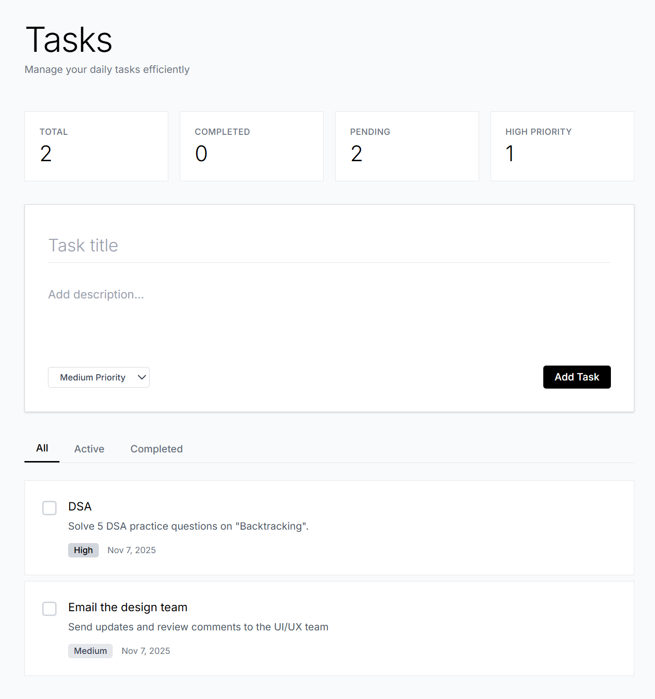
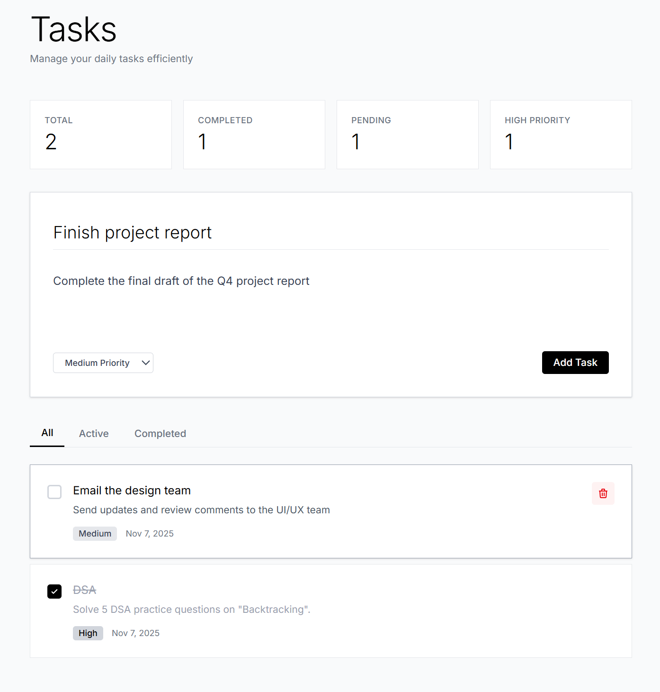

# Smart Task Manager

## Overview

Smart Task Manager is a full-stack task management application built with **FastAPI** (backend) and **Next.js** (frontend).  
It provides a complete end-to-end solution for managing tasks, including creating, updating, deleting, and viewing task statistics.  
The project follows modern web development practices and clean architecture principles.

---

## Features

- Full CRUD (Create, Read, Update, Delete) functionality for tasks
- Real-time task statistics (total, completed, pending, high priority)
- Priority-based categorization (low, medium, high)
- RESTful API with automatic documentation
- Type-safe frontend integration using TypeScript
- Responsive UI built with Tailwind CSS
- Error handling and validation using Pydantic and React state management

---

## Tech Stack

### Backend
- **Language:** Python 3.10+
- **Framework:** FastAPI
- **Database:** SQLite (can be configured for PostgreSQL or Neon)
- **ORM:** SQLAlchemy
- **Validation:** Pydantic
- **Server:** Uvicorn

### Frontend
- **Framework:** Next.js 14 (App Router)
- **Language:** TypeScript
- **Styling:** Tailwind CSS
- **HTTP Client:** Axios
- **UI Components:** React Functional Components with Hooks

---

## Project Structure

```
smart-task-manager/
├── backend/
│   ├── app/
│   │   ├── main.py
│   │   ├── models.py
│   │   ├── schemas.py
│   │   ├── database.py
│   │   └── crud.py
│   │   ├── requirements.txt
│   └── README.md
├── frontend/
│   ├── app/
│   │   ├── layout.tsx
│   │   ├── page.tsx
│   ├── components/
│   │   ├── TaskForm.tsx
│   │   └── TaskItem.tsx
│   ├── lib/
│   │   └── api.ts
│   ├── package.json
│   └── next.config.js
└── README.md
```

---

## Setup Instructions

### 1. Clone the Repository

```bash
git clone <repo-url>
cd smart-task-manager
```

### 2. Backend Setup

```bash
cd backend
python -m venv venv
source venv/bin/activate  
# On Windows:  [In Git bash]
source venv/Scripts/activate
pip install -r app/requirements.txt
cd app/
uvicorn main:app --reload --port 8000
```

**Access the backend at:** [http://localhost:8000](http://localhost:8000)  
**Interactive API docs:** [http://localhost:8000/docs](http://localhost:8000/docs)

### 3. Frontend Setup

```bash
cd ../frontend
npm install
npm run dev
```

**Access the frontend at:** [http://localhost:3000](http://localhost:3000)

---

## API Endpoints

| Method | Endpoint | Description |
|--------|-----------|-------------|
| GET | `/tasks` | Retrieve all tasks |
| POST | `/tasks` | Create a new task |
| GET | `/tasks/{id}` | Retrieve task by ID |
| PUT | `/tasks/{id}` | Update a task |
| DELETE | `/tasks/{id}` | Delete a task |
| GET | `/tasks/stats/summary` | Retrieve task statistics |

---

## Database Schema

**Table: tasks**

| Column | Type | Description |
|---------|------|-------------|
| id | Integer (PK) | Unique task ID |
| title | String | Task title |
| description | String | Task description |
| completed | Boolean | Completion status |
| priority | String | low / medium / high |
| created_at | DateTime | Creation timestamp |
| updated_at | DateTime | Last updated timestamp |

---

## Development Notes

- CORS is configured to allow frontend requests from `http://localhost:3000`.
- Replace `DATABASE_URL` in `.env` to use Neon PostgreSQL or any other database.
- Run backend and frontend concurrently for full functionality.

---

## Testing

1. Visit [http://localhost:3000](http://localhost:3000)
2. Add, toggle, or delete tasks using the form
3. Observe automatic updates in the statistics dashboard
4. Test API endpoints directly via [http://localhost:8000/docs](http://localhost:8000/docs)

---





